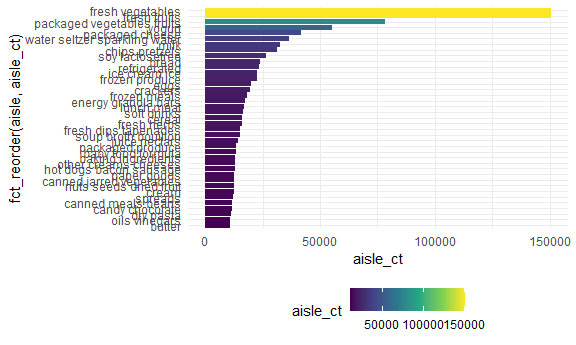
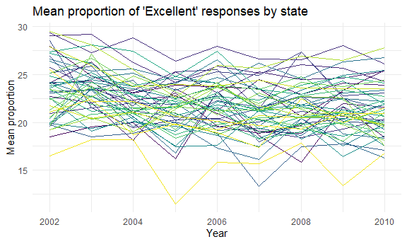
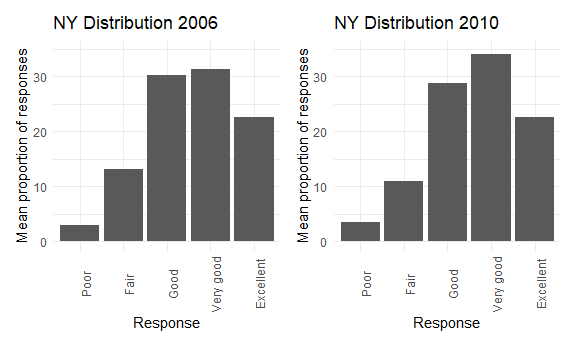

Homework 3
================
Safiya Sirota
2021-10-20

-   [Problem 1](#problem-1)
-   [Problem 2](#problem-2)
-   [Problem 3](#problem-3)

## Problem 1

``` r
nrow(instacart)
```

    ## [1] 1384617

``` r
ncol(instacart)
```

    ## [1] 15

``` r
names(instacart)
```

    ##  [1] "order_id"               "product_id"             "add_to_cart_order"     
    ##  [4] "reordered"              "user_id"                "eval_set"              
    ##  [7] "order_number"           "order_dow"              "order_hour_of_day"     
    ## [10] "days_since_prior_order" "product_name"           "aisle_id"              
    ## [13] "department_id"          "aisle"                  "department"

How many aisles are there, and which aisles are the most items ordered
from?

``` r
instacart %>% 
  group_by(aisle) %>% 
  summarize(aisle_ct = n()) %>% 
  nrow()
```

    ## [1] 134

``` r
instacart %>% 
  group_by(aisle) %>% 
  summarize(aisle_ct = n()) %>% 
  arrange(desc(aisle_ct)) %>% 
  top_n(5)
```

    ## Selecting by aisle_ct

    ## # A tibble: 5 x 2
    ##   aisle                      aisle_ct
    ##   <chr>                         <int>
    ## 1 fresh vegetables             150609
    ## 2 fresh fruits                 150473
    ## 3 packaged vegetables fruits    78493
    ## 4 yogurt                        55240
    ## 5 packaged cheese               41699

Make a plot that shows the number of items ordered in each aisle,
limiting this to aisles with more than 10000 items ordered. Arrange
aisles sensibly, and organize your plot so others can read it.

``` r
instacart %>% 
  group_by(aisle) %>% 
  summarize(aisle_ct = n()) %>% 
  filter(aisle_ct >= 10000) %>% 
  ggplot(aes(x = fct_reorder(aisle, aisle_ct), y = aisle_ct, fill = aisle_ct)) +
  geom_col() +
  coord_flip()
```



Make a table showing the three most popular items in each of the aisles
“baking ingredients”, “dog food care”, and “packaged vegetables fruits”.
Include the number of times each item is ordered in your table.

``` r
baking <-
  instacart %>% 
    filter(aisle == "baking ingredients") %>% 
    group_by(product_name) %>% 
    summarize(product_ct = n()) %>% 
    arrange(desc(product_ct)) %>% 
    top_n(3)  %>% 
    mutate(
      aisle = "Baking Ingredients",
      rank = 1:3
    )
```

    ## Selecting by product_ct

``` r
dog_food <-
  instacart %>% 
    filter(aisle == "dog food care") %>% 
    group_by(product_name) %>% 
    summarize(product_ct = n()) %>% 
    arrange(desc(product_ct)) %>% 
    top_n(3) %>% 
    mutate(
      aisle = "Dog Food & Care",
      rank = 1:3
    )
```

    ## Selecting by product_ct

``` r
pkg_veg_fruit <-
  instacart %>% 
    filter(aisle == "packaged vegetables fruits") %>% 
    group_by(product_name) %>% 
    summarize(product_ct = n()) %>% 
    arrange(desc(product_ct)) %>% 
    top_n(3) %>% 
    mutate(
      aisle = "Packaged Vegetables & Fruits",
      rank = 1:3
    )
```

    ## Selecting by product_ct

``` r
full_join(baking, dog_food) %>% 
  full_join(pkg_veg_fruit) %>% 
  select(aisle, rank, product_name, product_ct) %>% 
  knitr::kable()
```

    ## Joining, by = c("product_name", "product_ct", "aisle", "rank")

    ## Joining, by = c("product_name", "product_ct", "aisle", "rank")

| aisle                        | rank | product\_name                                 | product\_ct |
|:-----------------------------|-----:|:----------------------------------------------|------------:|
| Baking Ingredients           |    1 | Light Brown Sugar                             |         499 |
| Baking Ingredients           |    2 | Pure Baking Soda                              |         387 |
| Baking Ingredients           |    3 | Cane Sugar                                    |         336 |
| Dog Food & Care              |    1 | Snack Sticks Chicken & Rice Recipe Dog Treats |          30 |
| Dog Food & Care              |    2 | Organix Chicken & Brown Rice Recipe           |          28 |
| Dog Food & Care              |    3 | Small Dog Biscuits                            |          26 |
| Packaged Vegetables & Fruits |    1 | Organic Baby Spinach                          |        9784 |
| Packaged Vegetables & Fruits |    2 | Organic Raspberries                           |        5546 |
| Packaged Vegetables & Fruits |    3 | Organic Blueberries                           |        4966 |

Make a table showing the mean hour of the day at which Pink Lady Apples
and Coffee Ice Cream are ordered on each day of the week; format this
table for human readers (i.e. produce a 2 x 7 table).

``` r
instacart %>% 
  filter(product_name %in% c("Pink Lady Apples", "Coffee Ice Cream")) %>% 
  select(product_name, order_dow, order_hour_of_day) %>% 
  group_by(product_name, order_dow) %>% 
  summarize(mean_hour_of_day = mean(order_hour_of_day)) %>% 
  pivot_wider(
    names_from = order_dow,
    values_from = mean_hour_of_day
  ) %>% 
  rename(
      "Sunday" = `0`,
      "Monday" = `1`,
      "Tuesday" = `2`,
      "Wednesday" = `3`,
      "Thursday" = `4`,
      "Friday" = `5`,
      "Saturday" = `6`
      ) %>% 
  knitr::kable(digits = 1)
```

    ## `summarise()` has grouped output by 'product_name'. You can override using the `.groups` argument.

| product\_name    | Sunday | Monday | Tuesday | Wednesday | Thursday | Friday | Saturday |
|:-----------------|-------:|-------:|--------:|----------:|---------:|-------:|---------:|
| Coffee Ice Cream |   13.8 |   14.3 |    15.4 |      15.3 |     15.2 |   12.3 |     13.8 |
| Pink Lady Apples |   13.4 |   11.4 |    11.7 |      14.2 |     11.6 |   12.8 |     11.9 |

## Problem 2

Cleaning data

``` r
brfss_smart2010_tidy <-
brfss_smart2010 %>% 
  janitor::clean_names() %>% 
  filter(
    topic == "Overall Health" & 
    response %in% c("Poor", "Fair", "Good", "Very good", "Excellent")
    ) %>% 
  mutate(
    response = factor(response),
    response = forcats::fct_relevel(
      response, 
      c("Poor", "Fair", "Good", "Very good", "Excellent")
      )
  ) 
```

In 2002, which states were observed at 7 or more locations? What about
in 2010?

``` r
brfss_smart2010_tidy %>% 
  filter(year == 2002) %>% 
  select(locationabbr, locationdesc) %>% 
  group_by(locationabbr) %>% 
  summarize(county_ct = n_distinct(locationdesc)) %>% 
  filter(county_ct >= 7)
```

    ## # A tibble: 6 x 2
    ##   locationabbr county_ct
    ##   <chr>            <int>
    ## 1 CT                   7
    ## 2 FL                   7
    ## 3 MA                   8
    ## 4 NC                   7
    ## 5 NJ                   8
    ## 6 PA                  10

``` r
brfss_smart2010_tidy %>% 
  filter(year == 2010) %>% 
  select(locationabbr, locationdesc) %>% 
  group_by(locationabbr) %>% 
  summarize(county_ct = n_distinct(locationdesc)) %>% 
  filter(county_ct >= 7)
```

    ## # A tibble: 14 x 2
    ##    locationabbr county_ct
    ##    <chr>            <int>
    ##  1 CA                  12
    ##  2 CO                   7
    ##  3 FL                  41
    ##  4 MA                   9
    ##  5 MD                  12
    ##  6 NC                  12
    ##  7 NE                  10
    ##  8 NJ                  19
    ##  9 NY                   9
    ## 10 OH                   8
    ## 11 PA                   7
    ## 12 SC                   7
    ## 13 TX                  16
    ## 14 WA                  10

Construct a dataset that is limited to `Excellent` responses, and
contains, year, state, and a variable that averages the `data_value`
across locations within a state. Make a “spaghetti” plot of this average
value over time within a state.

``` r
brfss_smart2010_tidy %>% 
  filter(response == "Excellent") %>% 
  group_by(year, locationabbr) %>% 
  summarize(mean_data_value = mean(data_value, na.rm = TRUE)) %>% 
  ggplot(aes(x = year, y = mean_data_value, group = locationabbr)) +
  geom_line()
```

    ## `summarise()` has grouped output by 'year'. You can override using the `.groups` argument.



Make a two-panel plot showing, for the years 2006 and 2010, distribution
of `data_value` responses (“Poor” to “Excellent”) among locations in NY
State.

``` r
plot_2006 <-
  brfss_smart2010_tidy %>% 
  filter(year == 2006 & locationabbr == "NY") %>% 
  group_by(response) %>% 
  summarize(response_mean = mean(data_value)) %>% 
  ggplot(aes(x = response, y = response_mean)) +
  geom_col()

plot_2010 <-
  brfss_smart2010_tidy %>% 
  filter(year == 2010 & locationabbr == "NY") %>% 
  group_by(response) %>% 
  summarize(response_mean = mean(data_value)) %>% 
  ggplot(aes(x = response, y = response_mean)) +
  geom_col()

plot_2006 + plot_2010
```



## Problem 3
