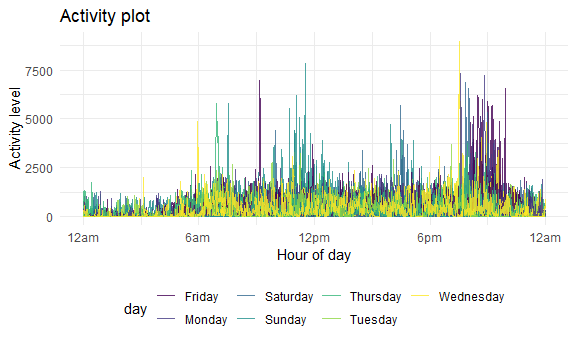

Homework 3
================
Safiya Sirota
2021-10-20

-   [Problem 1](#problem-1)
-   [Problem 2](#problem-2)
-   [Problem 3](#problem-3)

## Problem 1

**Describing the `instacart` dataset:**

`instacart` is a dataset with 1384617 rows and 15 columns. Each row
represents a single product that was part of an order via Instacart.
Some key variables that we use in our exploration below are

-   `product_name` (e.g., “Bulgarian Yogurt”, “Organic 4% Milk Fat Whole
    Milk Cottage Cheese”, or `"r pull(instacart, product_name)[3]`"),

-   `aisle` (e.g., “yogurt”, “other creams cheeses”, or “fresh
    vegetables”), and

-   `order_hour_of_day`, which notes the the hour of day from 0-23
    during which the order was placed.

**Counting aisles:**

``` r
instacart %>% 
  group_by(aisle) %>% 
  summarize(aisle_ct = n()) %>% 
  nrow()
```

    ## [1] 134

There are 134 aisles in the dataset.

**Determining popular aisles:**

``` r
instacart %>% 
  group_by(aisle) %>% 
  summarize(aisle_ct = n()) %>% 
  arrange(desc(aisle_ct)) %>% 
  top_n(5) %>% 
  knitr::kable()
```

    ## Selecting by aisle_ct

| aisle                      | aisle\_ct |
|:---------------------------|----------:|
| fresh vegetables           |    150609 |
| fresh fruits               |    150473 |
| packaged vegetables fruits |     78493 |
| yogurt                     |     55240 |
| packaged cheese            |     41699 |

It makes sense to me that fruits and vegetables are ordered often. There
are a wide variety of foods in these aisles, they represent important
food groups, and fruits and vegetables also go bad quicker than other
items which calls for more frequent orders. Packaged cheese is also a
common product and can run out quickly. Especially because cheese is a
common ingredient for breakfast, lunch, and dinner recipes. I’m a little
surprised that yogurt is also on this top 5 list,, but if each small
yogurt container counts as 1 item, people may buy many units each time
they order, which add up quickly.

**Making a plot showing the number of items ordered in each aisle:**\_

``` r
instacart %>% 
  group_by(aisle) %>% 
  summarize(aisle_ct = n()) %>% 
  filter(aisle_ct >= 10000) %>% 
  ggplot(aes(x = fct_reorder(aisle, aisle_ct), y = aisle_ct, fill = aisle_ct)) +
  geom_col() +
  coord_flip() +
  scale_y_continuous(
    breaks = c(25000, 50000, 75000, 100000, 125000, 150000)
  ) + 
  labs(
    title = "Instacart orders",
    x = "Aisle",
    y = "Number of products ordered"
  ) +
  theme(legend.position = "none")
```


A couple things that surprise me about this plot are the amount of
orders from the water aisle and the lack of orders from the butter
aisle. The high volume of water orders show that customers may not favor
tap water or water filters. Many may instead enjoy bottled or sparkling
water more than I thought. I also thought butter would be ordered more
frequently. In a larger household, it seems like a refrigerator staple
that could run out quickly. Perhaps butter (and oils and vinegars) last
longer and require less reorders.

**Showing the 3 most popular items in 3 aisles:**

``` r
baking <-
  instacart %>% 
    filter(aisle == "baking ingredients") %>% 
    group_by(product_name) %>% 
    summarize(product_ct = n()) %>% 
    arrange(desc(product_ct)) %>% 
    top_n(3)  %>% 
    mutate(
      aisle = "Baking Ingredients",
      rank = 1:3
    )
```

    ## Selecting by product_ct

``` r
dog_food <-
  instacart %>% 
    filter(aisle == "dog food care") %>% 
    group_by(product_name) %>% 
    summarize(product_ct = n()) %>% 
    arrange(desc(product_ct)) %>% 
    top_n(3) %>% 
    mutate(
      aisle = "Dog Food & Care",
      rank = 1:3
    )
```

    ## Selecting by product_ct

``` r
pkg_veg_fruit <-
  instacart %>% 
    filter(aisle == "packaged vegetables fruits") %>% 
    group_by(product_name) %>% 
    summarize(product_ct = n()) %>% 
    arrange(desc(product_ct)) %>% 
    top_n(3) %>% 
    mutate(
      aisle = "Packaged Vegetables & Fruits",
      rank = 1:3
    )
```

    ## Selecting by product_ct

``` r
full_join(baking, dog_food) %>% 
  full_join(pkg_veg_fruit) %>% 
  select(aisle, rank, product_name, product_ct) %>% 
  knitr::kable()
```

    ## Joining, by = c("product_name", "product_ct", "aisle", "rank")

    ## Joining, by = c("product_name", "product_ct", "aisle", "rank")

| aisle                        | rank | product\_name                                 | product\_ct |
|:-----------------------------|-----:|:----------------------------------------------|------------:|
| Baking Ingredients           |    1 | Light Brown Sugar                             |         499 |
| Baking Ingredients           |    2 | Pure Baking Soda                              |         387 |
| Baking Ingredients           |    3 | Cane Sugar                                    |         336 |
| Dog Food & Care              |    1 | Snack Sticks Chicken & Rice Recipe Dog Treats |          30 |
| Dog Food & Care              |    2 | Organix Chicken & Brown Rice Recipe           |          28 |
| Dog Food & Care              |    3 | Small Dog Biscuits                            |          26 |
| Packaged Vegetables & Fruits |    1 | Organic Baby Spinach                          |        9784 |
| Packaged Vegetables & Fruits |    2 | Organic Raspberries                           |        5546 |
| Packaged Vegetables & Fruits |    3 | Organic Blueberries                           |        4966 |

I find it interesting that light brown sugar was ordered more than cane
sugar, since I think it’s more common for baking recipes to call for
cane sugar. Perhaps people already have large quantities of cane sugar
at home but prefer to buy smaller packs of brown sugar and reorder when
needed. It makes sense to me that the top items from the dog food aisle
are treats and foods. I find it interesting that the most frequently
ordered packaged vegetable or fruit is a vegetable. Perhaps this shows
that spinach is a very popular packaged vegetable, while people may have
a wider variety of preferences when it comes to which packaged fruits
they like to order.

**Showing the mean hour of day at which Pink Lady Apples and Coffee Ice
Cream are ordered on each day of the week:**

``` r
instacart %>% 
  filter(product_name %in% c("Pink Lady Apples", "Coffee Ice Cream")) %>% 
  select(product_name, order_dow, order_hour_of_day) %>% 
  group_by(product_name, order_dow) %>% 
  summarize(mean_hour_of_day = mean(order_hour_of_day)) %>% 
  pivot_wider(
    names_from = order_dow,
    values_from = mean_hour_of_day
  ) %>% 
  rename(
      "Sunday" = `0`,
      "Monday" = `1`,
      "Tuesday" = `2`,
      "Wednesday" = `3`,
      "Thursday" = `4`,
      "Friday" = `5`,
      "Saturday" = `6`
      ) %>% 
  knitr::kable(digits = 1)
```

    ## `summarise()` has grouped output by 'product_name'. You can override using the `.groups` argument.

| product\_name    | Sunday | Monday | Tuesday | Wednesday | Thursday | Friday | Saturday |
|:-----------------|-------:|-------:|--------:|----------:|---------:|-------:|---------:|
| Coffee Ice Cream |   13.8 |   14.3 |    15.4 |      15.3 |     15.2 |   12.3 |     13.8 |
| Pink Lady Apples |   13.4 |   11.4 |    11.7 |      14.2 |     11.6 |   12.8 |     11.9 |

It seems that Coffee Ice Cream is ordered, on average, later in the day
on each day of the week besides Friday. The website describing
`instacart` finds that “ice cream and frozen pizza are the most
frequently ordered products late at night.” I think that fact could
account for the higher mean of Coffee Ice Cream when compared to Pink
Lady Apples.

## Problem 2

Cleaning data

``` r
brfss_smart2010_tidy <-
brfss_smart2010 %>% 
  janitor::clean_names() %>% 
  filter(
    topic == "Overall Health" & 
    response %in% c("Poor", "Fair", "Good", "Very good", "Excellent")
    ) %>% 
  mutate(
    response = factor(response),
    response = forcats::fct_relevel(
      response, 
      c("Poor", "Fair", "Good", "Very good", "Excellent")
      )
  ) 
```

In 2002, which states were observed at 7 or more locations? What about
in 2010?

``` r
brfss_smart2010_tidy %>% 
  filter(year == 2002) %>% 
  select(locationabbr, locationdesc) %>% 
  group_by(locationabbr) %>% 
  summarize(county_ct = n_distinct(locationdesc)) %>% 
  filter(county_ct >= 7)
```

    ## # A tibble: 6 x 2
    ##   locationabbr county_ct
    ##   <chr>            <int>
    ## 1 CT                   7
    ## 2 FL                   7
    ## 3 MA                   8
    ## 4 NC                   7
    ## 5 NJ                   8
    ## 6 PA                  10

``` r
brfss_smart2010_tidy %>% 
  filter(year == 2010) %>% 
  select(locationabbr, locationdesc) %>% 
  group_by(locationabbr) %>% 
  summarize(county_ct = n_distinct(locationdesc)) %>% 
  filter(county_ct >= 7)
```

    ## # A tibble: 14 x 2
    ##    locationabbr county_ct
    ##    <chr>            <int>
    ##  1 CA                  12
    ##  2 CO                   7
    ##  3 FL                  41
    ##  4 MA                   9
    ##  5 MD                  12
    ##  6 NC                  12
    ##  7 NE                  10
    ##  8 NJ                  19
    ##  9 NY                   9
    ## 10 OH                   8
    ## 11 PA                   7
    ## 12 SC                   7
    ## 13 TX                  16
    ## 14 WA                  10

Construct a dataset that is limited to `Excellent` responses, and
contains, year, state, and a variable that averages the `data_value`
across locations within a state. Make a “spaghetti” plot of this average
value over time within a state.

``` r
brfss_smart2010_tidy %>% 
  filter(response == "Excellent") %>% 
  group_by(year, locationabbr) %>% 
  summarize(mean_data_value = mean(data_value, na.rm = TRUE)) %>% 
  ggplot(aes(x = year, y = mean_data_value, group = locationabbr)) +
  geom_line()
```

    ## `summarise()` has grouped output by 'year'. You can override using the `.groups` argument.


Make a two-panel plot showing, for the years 2006 and 2010, distribution
of `data_value` responses (“Poor” to “Excellent”) among locations in NY
State.

``` r
plot_2006 <-
  brfss_smart2010_tidy %>% 
  filter(year == 2006 & locationabbr == "NY") %>% 
  group_by(response) %>% 
  summarize(response_mean = mean(data_value)) %>% 
  ggplot(aes(x = response, y = response_mean)) +
  geom_col()

plot_2010 <-
  brfss_smart2010_tidy %>% 
  filter(year == 2010 & locationabbr == "NY") %>% 
  group_by(response) %>% 
  summarize(response_mean = mean(data_value)) %>% 
  ggplot(aes(x = response, y = response_mean)) +
  geom_col()

plot_2006 + plot_2010
```


## Problem 3

Load, tidy, and otherwise wrangle the data. Your final dataset should
include all originally observed variables and values; have useful
variable names; include a weekday vs weekend variable; and encode data
with reasonable variable classes. Describe the resulting dataset
(e.g. what variables exist, how many observations, etc).

``` r
accel_df <- read_csv("./data/accel_data.csv") %>% 
  janitor::clean_names() %>% 
  mutate(
    weekday_vs_weekend = case_when(
      day %in% c("Saturday", "Sunday") ~ "weekend",
      TRUE ~ "weekday")
  )
```

    ## Rows: 35 Columns: 1443

    ## -- Column specification --------------------------------------------------------
    ## Delimiter: ","
    ## chr    (1): day
    ## dbl (1442): week, day_id, activity.1, activity.2, activity.3, activity.4, ac...

    ## 
    ## i Use `spec()` to retrieve the full column specification for this data.
    ## i Specify the column types or set `show_col_types = FALSE` to quiet this message.

Traditional analyses of accelerometer data focus on the total activity
over the day. Using your tidied dataset, aggregate accross minutes to
create a total activity variable for each day, and create a table
showing these totals. Are any trends apparent?

``` r
accel_df %>% 
  rowwise(day_id) %>% 
  mutate(activity_total = sum(c_across(activity_1:activity_1440))) %>% 
  select(day_id, day, weekday_vs_weekend, activity_total) %>% 
  knitr::kable(digits = 1)
```

| day\_id | day       | weekday\_vs\_weekend | activity\_total |
|--------:|:----------|:---------------------|----------------:|
|       1 | Friday    | weekday              |        480542.6 |
|       2 | Monday    | weekday              |         78828.1 |
|       3 | Saturday  | weekend              |        376254.0 |
|       4 | Sunday    | weekend              |        631105.0 |
|       5 | Thursday  | weekday              |        355923.6 |
|       6 | Tuesday   | weekday              |        307094.2 |
|       7 | Wednesday | weekday              |        340115.0 |
|       8 | Friday    | weekday              |        568839.0 |
|       9 | Monday    | weekday              |        295431.0 |
|      10 | Saturday  | weekend              |        607175.0 |
|      11 | Sunday    | weekend              |        422018.0 |
|      12 | Thursday  | weekday              |        474048.0 |
|      13 | Tuesday   | weekday              |        423245.0 |
|      14 | Wednesday | weekday              |        440962.0 |
|      15 | Friday    | weekday              |        467420.0 |
|      16 | Monday    | weekday              |        685910.0 |
|      17 | Saturday  | weekend              |        382928.0 |
|      18 | Sunday    | weekend              |        467052.0 |
|      19 | Thursday  | weekday              |        371230.0 |
|      20 | Tuesday   | weekday              |        381507.0 |
|      21 | Wednesday | weekday              |        468869.0 |
|      22 | Friday    | weekday              |        154049.0 |
|      23 | Monday    | weekday              |        409450.0 |
|      24 | Saturday  | weekend              |          1440.0 |
|      25 | Sunday    | weekend              |        260617.0 |
|      26 | Thursday  | weekday              |        340291.0 |
|      27 | Tuesday   | weekday              |        319568.0 |
|      28 | Wednesday | weekday              |        434460.0 |
|      29 | Friday    | weekday              |        620860.0 |
|      30 | Monday    | weekday              |        389080.0 |
|      31 | Saturday  | weekend              |          1440.0 |
|      32 | Sunday    | weekend              |        138421.0 |
|      33 | Thursday  | weekday              |        549658.0 |
|      34 | Tuesday   | weekday              |        367824.0 |
|      35 | Wednesday | weekday              |        445366.0 |

It seems that

Accelerometer data allows the inspection activity over the course of the
day. Make a single-panel plot that shows the 24-hour activity time
courses for each day and use color to indicate day of the week. Describe
in words any patterns or conclusions you can make based on this graph.

``` r
accel_df %>% 
  pivot_longer(
    activity_1:activity_1440,
    names_to = "minute",
    names_prefix = "activity_",
    values_to = "activity"
  ) %>% 
  mutate(minute = as.numeric(minute)) %>% 
  ggplot(aes(x = minute, y = activity, group = day_id, color = day)) +
  geom_line(alpha = .8) +
  scale_x_continuous(
    breaks = c(1, 360, 720, 1080, 1440),
    labels = c("12am", "6am", "12pm", "6pm", "12am")
  ) + labs(
    title = "Activity plot",
    x = "Hour of day",
    y = "Activity level"
  )
```


